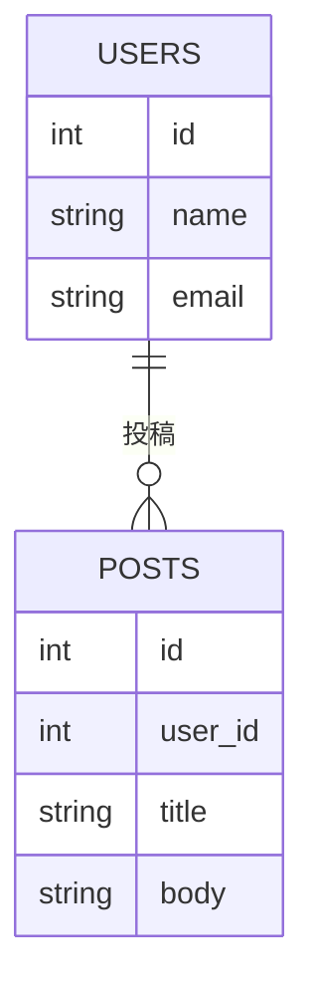
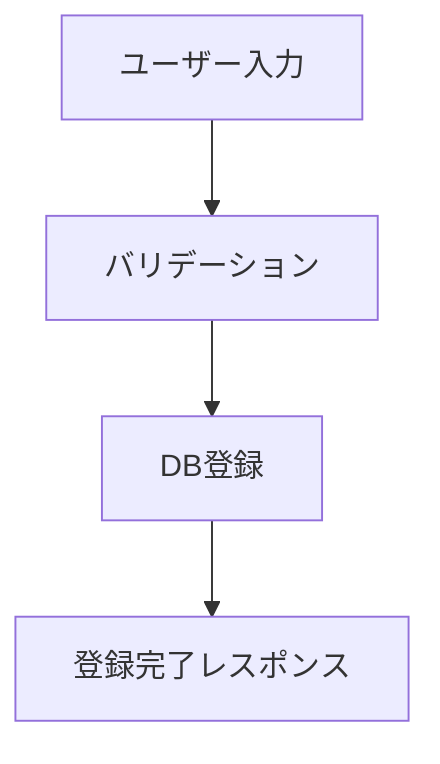

# サンプル仕様書

---
## タイトル

ユーザー管理API仕様書

## 概要

本仕様書は、ユーザー管理機能のAPI仕様を定義するものである。

## 用語集

| 用語 | 定義 |
| ---- | ---- |
| ユーザー | サービスを利用する個人を指す |
| API | アプリケーションプログラミングインターフェース |

## 詳細

### 機能要件

- ユーザーを新規登録できること
- ユーザー情報を取得できること
- ユーザー情報を更新できること

### 非機能要件

- APIのレスポンスは1秒以内で返すこと
- 通信はHTTPSで暗号化すること
- ユーザー情報は適切に認証・認可された場合のみ操作可能とすること

### ユースケース

- ユーザー登録：新規ユーザーがサービスに登録する
- ユーザー情報取得：既存ユーザーの情報を取得する
- ユーザー情報更新：ユーザーが自分の情報を更新する

#### ユースケース図（Marmaid記法例）

```mermaid
usecaseDiagram
  actor ユーザー
  ユーザー --> (ユーザー登録)
  ユーザー --> (ユーザー情報取得)
  ユーザー --> (ユーザー情報更新)
```

### 画面イメージ

- 省略（必要に応じてワイヤーフレームや画面設計を記載）

### API仕様

| メソッド | パス              | 概要               |
| -------- | ----------------- | ------------------ |
| POST     | /api/users        | ユーザー新規登録   |
| GET      | /api/users/{id}   | ユーザー情報取得   |
| PUT      | /api/users/{id}   | ユーザー情報更新   |

#### リクエスト・レスポンス例

- POST /api/users
```json
{
  "name": "Taro",
  "email": "taro@example.com"
}
```

- レスポンス
```json
{
  "id": 1,
  "name": "Taro",
  "email": "taro@example.com"
}
```

### データ構造

- ユーザーテーブル
  - id: 整数, 主キー
  - name: 文字列, 必須
  - email: 文字列, 必須

#### テーブル設計（Marmaid記法例）



### フロー図

ユーザー登録処理のフロー例：



## 関連資料

- [OpenAPI仕様書](openapi.yaml)

## 更新履歴

| 日付       | 変更内容   | 担当者    |
| ---------- | ---------- | --------- |
| 2025-04-22 | 初版作成   | masanork  |
