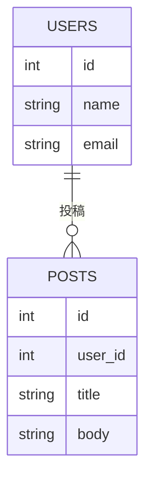

# 仕様書テンプレート

---
## タイトル
例：API仕様書、要件定義書などを記載する。

## 概要
本仕様書の目的や背景を記載する。

## 用語集
| 用語 | 定義 |
| ---- | ---- |
|      |      |

## 詳細
### 機能一覧
本システムに実装する主な機能を箇条書きで列挙する。

### 画面イメージ
画面設計やワイヤーフレームがあれば記載する。

### API仕様
APIエンドポイントやパラメータ、レスポンス例などを記載する。

### データ構造
本システムで利用する主なデータ構造やテーブル定義を記載する。

#### ER図（Marmaid記法例）

### フロー図
業務フローやシステム処理の流れをMarmaid記法などで記載する。

## 関連資料
参考となる資料や外部リンクを記載する。

## 更新履歴
| 日付 | 変更内容 | 担当者 |
| ---- | -------- | ------ |
| yyyy-mm-dd | 初版作成 | 名前 |
